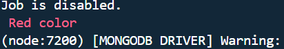

# console-color
console-color is a lightweight, dependency-free JavaScript library that allows you to easily add colors to your console output based on user preferences. With a size of less than 4KB, it's perfect for enhancing the readability of your CLI applications without adding bloat.


## Features

- **No Dependencies**: console-color is completely standalone.
- **Tiny Size**: Less than 4KB.
- **Easy to Use**: Simple and intuitive API for adding colors to console output.
- **Customizable**: Support for various colors to match user preferences.

# install 
```sh
npm i @rao123dk/console-color

yarn add @rao123dk/console-color
```

# setup
Require the Library in Your Entry File
In your index.js file, require your `@rao123dk/console-color` library:

```sh
require(`@rao123dk/console-color`)
```


# use

```javascript
console.log.red('red color');
```


```javascript
console.log.green('green color');
```


```javascript
console.log.green.bold('Success: Operation completed successfully.');
```


```javascript
console.log.yellow('yellow color');
```


```javascript
console.log.blue('blue color');
```

```javascript
console.log.magenta('magenta color');
```

```javascript
console.log.cyan('cyan color');
```


```javascript
console.log.white('white color');
```

# Example

```javascript
console.log.red('Error: Something went wrong!');
console.log.green('Success: Operation completed successfully.');
console.log.blue('Info: Please check the details below.');
console.log.yellow('Warning: Please be cautious.');
console.log.cyan('Debug: Variable value is undefined.');
console.log.magenta('Notice: This is an important notice.');
console.log.white('General: This is a general message.');

console.log.blue.italic('Info: Please check the details below.');
console.log.yellow.underline('Warning: Please be cautious.');
console.log.white.background('General: This is a general message.');

```

# Contributing
We welcome contributions! If you'd like to contribute, please fork the repository and submit a pull request.

## License

`@rao123dk/console-color` is licensed under the MIT License. See the LICENSE file for more details.